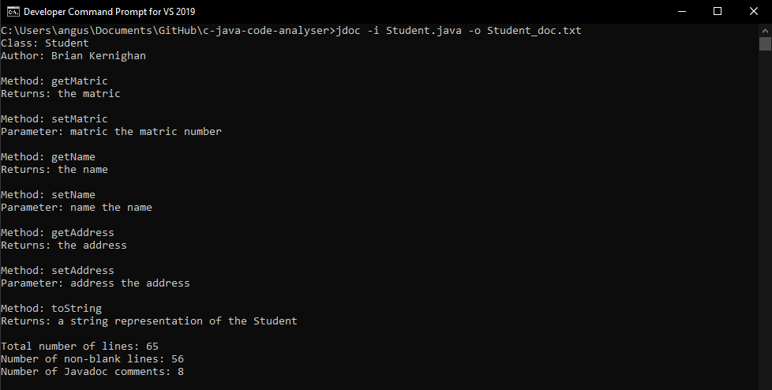

# JDOC
 C language command line application that reads in .java files and analyses the java code within it for data such as:

 - Number of lines in .java file
 - Number of non-blank lines in .java file
 - Number of Javadoc comments


```
Developer Command Prompt for VS 2019 is used for building 
```
[Learn More](https://docs.microsoft.com/en-us/visualstudio/ide/reference/command-prompt-powershell?view=vs-2019)

Contents
- [JDOC](#jdoc)
  - [How to build](#how-to-build)
  - [How to clean](#how-to-clean)
  - [Running the app](#running-the-app)
  - [Screenshots](#screenshots)


## How to build

See `Makefile` for the build script.

Once in the project's directory from Microsoft Compiler, simply run `nmake build`.

This will generate an executable called `jdoc.exe`, and an object code file `jdoc.obj`.

```
nmake build
```

## How to clean

If you need to delete the executable and object code at any time, `nmake clean` can be used. Please remember to build again before trying to run the application.

```
nmake clean
```
## Running the app

Once built, JDOC can be ran with Microsoft Compiler CLI. JDOC requires two command line arguments to run successfully:

• `-i` specifies the input file you wish to read from. 

• `-o` specifies name of the file you will be outputting to. 

Output files can be called anything you wish, however special characters and spaces should be avoided.

Input files are currently limited to either `Student.java` or `Rectangle.java`. These could be extended by adding new Java files into the `/src` directory.

Example valid Student.java run command:
```
jdoc -i Student.java -o Student_doc.txt
```

Example valid Rectangle.java run command:
```
jdoc -i Rectangle.java -o Rectangle_doc.txt
```

## Screenshots
